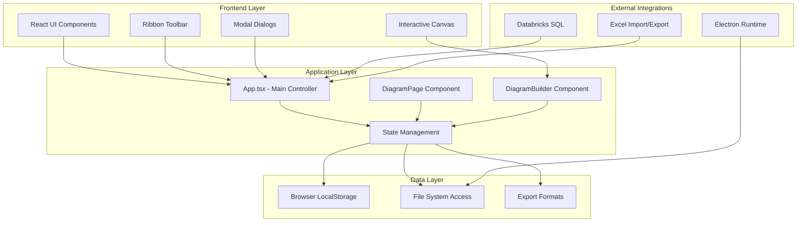
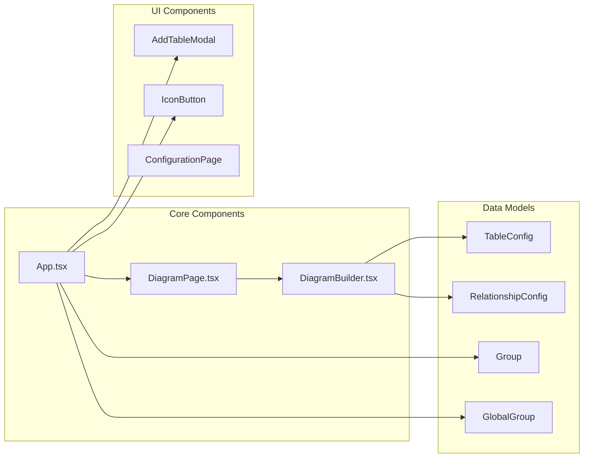
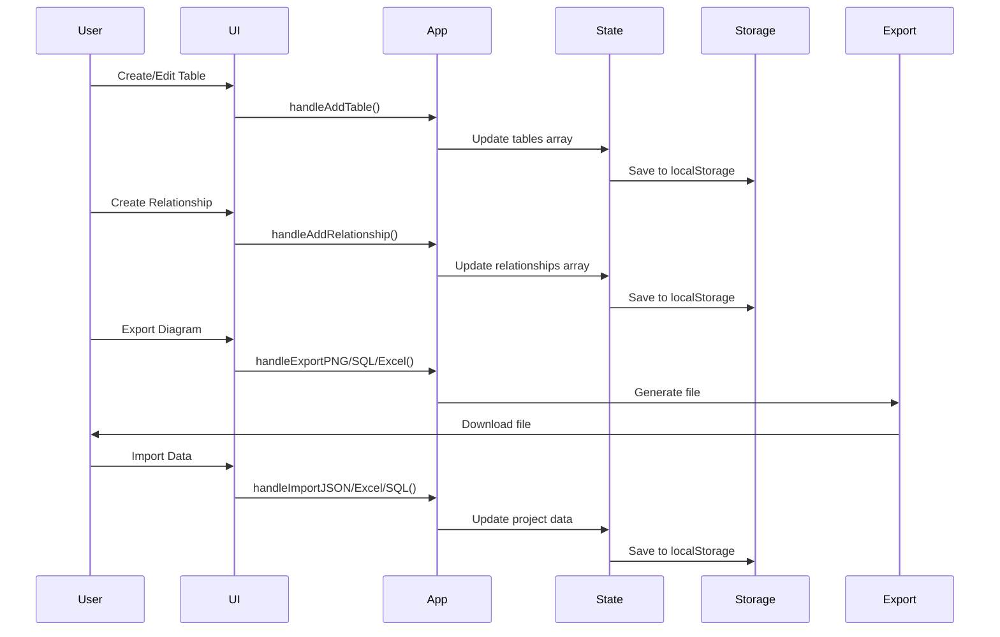
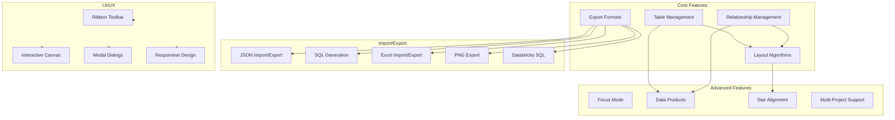
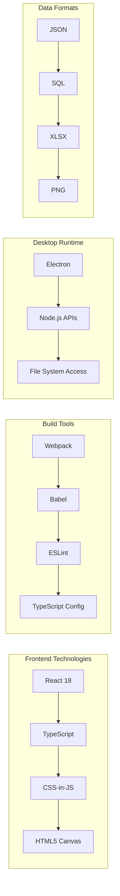
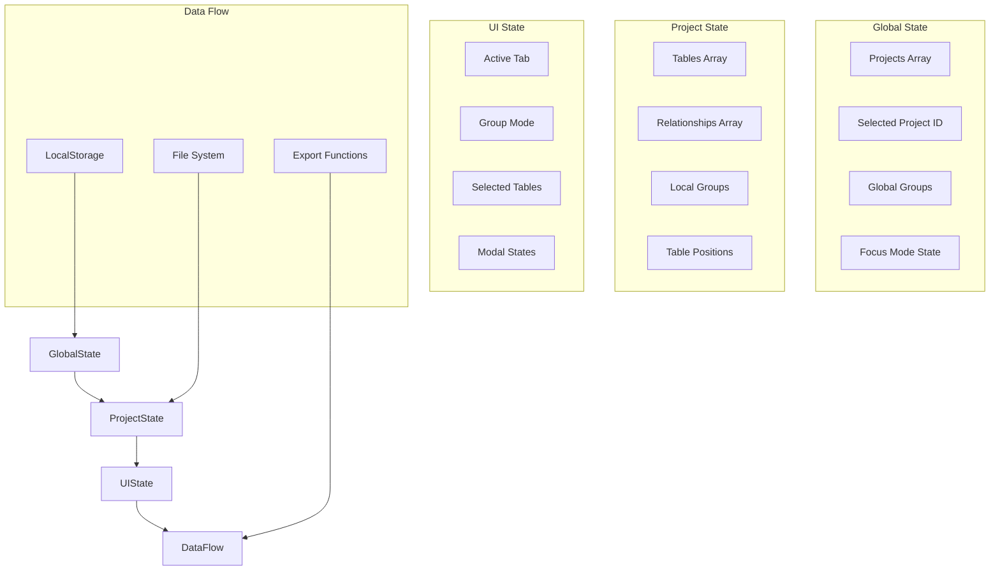
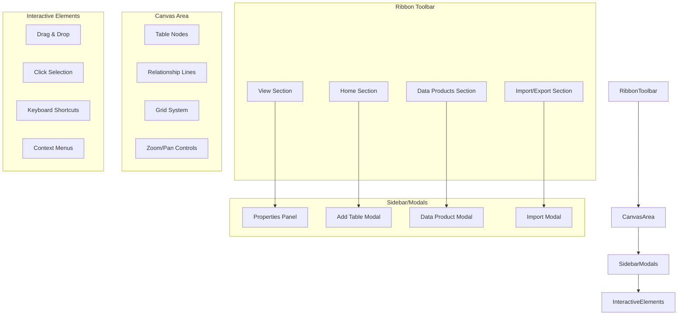
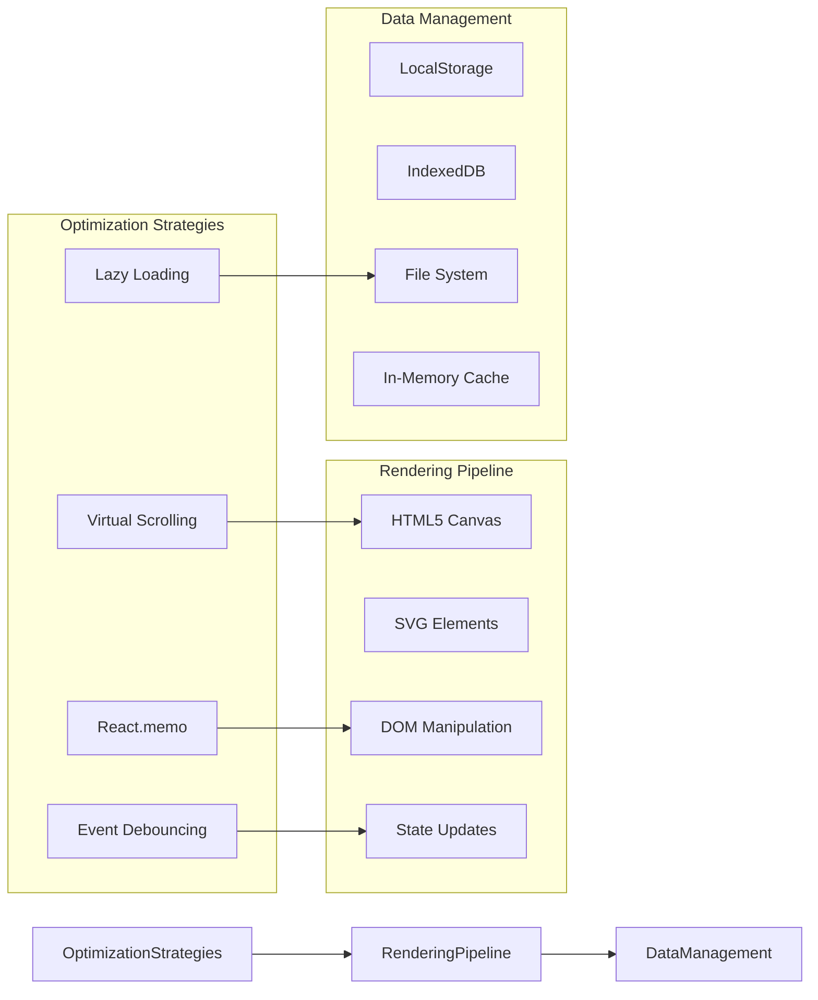
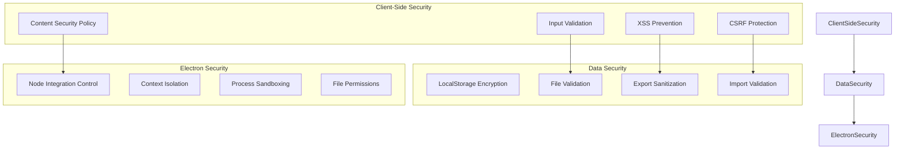
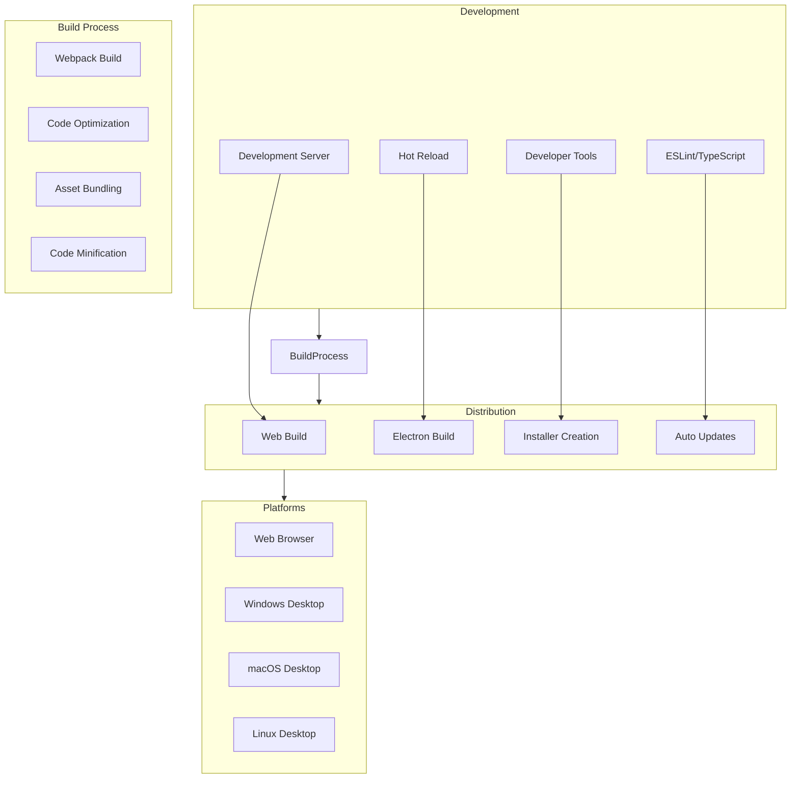

# ER Diagram Builder - System Architecture

## 🏗️ High-Level Architecture Overview

## 🔧 Component Architecture

## 📊 Data Flow Architecture

## 🎯 Feature Architecture

## 🛠️ Technology Stack

## 🔄 State Management Architecture

## 🎨 UI/UX Architecture

## 📈 Performance Architecture

## 🔒 Security Architecture

## 🚀 Deployment Architecture

---

## 📋 Key Architecture Highlights

### **1. Modular Component Design**
- Clear separation of concerns between UI, business logic, and data layers
- Reusable components with well-defined interfaces
- TypeScript for type safety and better developer experience

### **2. Hybrid Architecture**
- Web-first development with Electron desktop wrapper
- Single codebase for both web and desktop platforms
- Progressive enhancement approach

### **3. State Management**
- React hooks for local state management
- LocalStorage for persistence
- Multi-project support with global state

### **4. Export/Import Capabilities**
- Multiple format support (JSON, SQL, Excel, PNG)
- Databricks SQL integration
- File system access through Electron

### **5. Advanced Features**
- Focus Mode for better diagram navigation
- Data Products for logical grouping
- Star alignment for fact/dimension tables
- Layout algorithms (Force-directed, Grid, Tree)

### **6. Performance Optimizations**
- Canvas-based rendering for large diagrams
- Debounced event handling
- Lazy loading of components
- Efficient state updates

This architecture provides a solid foundation for a professional ER diagram builder with enterprise-grade features while maintaining simplicity and usability. 