# ER Diagram Builder - Presentation Architecture

## 🎯 Executive Summary Architecture

```mermaid
graph TB
    subgraph "🎨 User Interface"
        Ribbon[Professional Ribbon Toolbar]
        Canvas[Interactive Canvas]
        FocusMode[Focus Mode Navigation]
        DataProducts[Data Products Management]
    end
    
    subgraph "⚡ Core Engine"
        React[React 18 + TypeScript]
        State[State Management]
        Layout[Layout Algorithms]
        Export[Multi-Format Export]
    end
    
    subgraph "🔗 Integrations"
        Databricks[Databricks SQL]
        Excel[Excel Import/Export]
        SQL[SQL Generation]
        PNG[Visual Export]
    end
    
    subgraph "🚀 Deployment"
        Web[Web Application]
        Desktop[Desktop App - Electron]
        CrossPlatform[Cross-Platform Support]
    end
    
    UserInterface --> CoreEngine
    CoreEngine --> Integrations
    CoreEngine --> Deployment
    
    Ribbon --> React
    Canvas --> State
    FocusMode --> Layout
    DataProducts --> Export
    
    React --> Databricks
    State --> Excel
    Layout --> SQL
    Export --> PNG
    
    React --> Web
    State --> Desktop
    Layout --> CrossPlatform
```

## 🏆 Key Technical Achievements

### **1. Hybrid Architecture**

### **2. Advanced Features**

### **3. Data Flow Architecture**

## 🎨 User Experience Architecture

## 🛠️ Technology Stack

## 📊 Feature Comparison

| Feature | ER Diagram Builder | Traditional Tools |
|---------|-------------------|-------------------|
| **Platform** | Web + Desktop | Desktop Only |
| **Data Products** | ✅ Built-in | ❌ Manual |
| **Star Alignment** | ✅ Auto | ❌ Manual |
| **Focus Mode** | ✅ Smart Navigation | ❌ Basic |
| **Databricks Integration** | ✅ Native | ❌ External |
| **Multi-Project** | ✅ Global Groups | ❌ Single Project |
| **Export Formats** | 5+ Formats | 2-3 Formats |
| **Auto Layout** | ✅ Multiple Algorithms | ❌ Basic |

## 🚀 Deployment Architecture

## 🎯 Business Value Proposition

### **For Data Engineers:**
- **Databricks SQL Integration** - Direct import from Databricks
- **SQL Generation** - Auto-generate DDL statements
- **Star Schema Support** - Built-in fact/dimension modeling

### **For Data Architects:**
- **Data Products** - Logical grouping and management
- **Multi-Project Support** - Global data product catalog
- **Professional Export** - High-quality visual outputs

### **For Business Users:**
- **Excel Integration** - Familiar import/export format
- **Focus Mode** - Easy navigation of complex diagrams
- **Auto Layout** - Professional diagram arrangement

### **For Development Teams:**
- **Single Codebase** - Web and desktop from one source
- **TypeScript** - Type-safe development
- **Modern Stack** - React 18 + latest technologies

## 📈 Performance Metrics

- **Load Time**: < 2 seconds for complex diagrams
- **Export Speed**: < 5 seconds for PNG/SQL generation
- **Memory Usage**: < 100MB for large diagrams
- **Cross-Platform**: Windows, macOS, Linux, Web
- **File Size**: < 50MB for desktop distribution

---

## 🏆 Presentation Talking Points

### **1. Technical Innovation**
- **Hybrid Architecture**: Single codebase for web and desktop
- **Modern Stack**: React 18 + TypeScript + Electron
- **Enterprise Integration**: Native Databricks SQL support

### **2. User Experience**
- **Professional UI**: Ribbon toolbar like Microsoft Office
- **Smart Features**: Auto-detection, focus mode, star alignment
- **Data Products**: Logical grouping for enterprise use

### **3. Business Value**
- **Cost Effective**: Free, open-source alternative to expensive tools
- **Cross-Platform**: Works everywhere - web, Windows, macOS, Linux
- **Enterprise Ready**: Databricks integration, multi-project support

### **4. Competitive Advantages**
- **Modern Technology**: Built with latest web technologies
- **Open Source**: Community-driven development
- **Extensible**: Easy to add new features and integrations

This architecture demonstrates a professional, enterprise-grade ER diagram builder that competes with commercial tools while being free and open-source. 